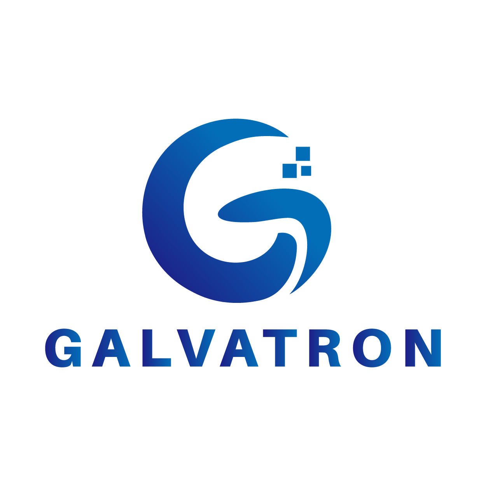
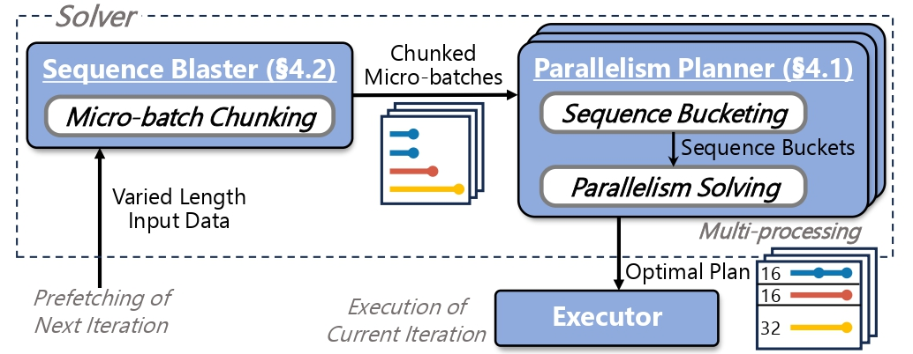

<div align=center>  </div>

# Galvatron-2

[](https://github.com/PKU-DAIR/Hetu-Galvatron/blob/main/LICENSE)
[](https://github.com/PKU-DAIR/Hetu-Galvatron/releases)
[](https://pypi.org/project/hetu-galvatron/)
[](https://hetu-galvatron.readthedocs.io)
[](https://pepy.tech/project/hetu-galvatron)

[](https://codecov.io/gh/PKU-DAIR/Hetu-Galvatron)

[Galvatron Documents](https://hetu-galvatron.readthedocs.io) | [Galvatron 中文文档](https://hetu-galvatron.readthedocs.io/zh_CN/)

Galvatron is an automatic distributed training system designed for Transformer models, including Large Language Models (LLMs). It leverages advanced automatic parallelism techniques to deliver exceptional training efficiency. This repository houses the official implementation of Galvatron-2, our latest version enriched with several new features.

## Key Features
### (1) Enhanced Efficiency via Automatic Parallelism

#### Enlarged Parallelism Search Space
Incorporate multiple popular parallelism dimensions of distributed training, including DP (Data Parallelism), SDP (Sharded Data Parallelism, support ZeRO-1, ZeRO-2 and ZeRO-3), PP (Pipeline Parallelism, support both GPipe & Pipedream-flush / 1F1B-flush), TP (Tensor Parallelism), SP (Sequence Parallelism, support Megatron-SP and Deepspeed-Ulysses). Also incorporate CKPT (Activation Checkpointing) as a special parallelism dimension.

#### Fine-grained Hybrid Parallelism
Galvatron's approach to hybrid parallelism represents a significant advancement in distributed training optimization. Rather than applying a one-size-fits-all strategy, the system enables layer-wise parallelization, allowing each transformer layer to utilize an independent combination of parallel strategies. This granular approach ensures optimal resource utilization by adapting to the specific computational and memory requirements of each layer.

The system dynamically combines multiple parallelism types, carefully considering the trade-offs between computation, memory usage, and communication overhead. This hybrid approach is particularly powerful when dealing with complex model architectures, where different layers may benefit from different parallelization strategies.

#### Efficient Automatic Parallelism Optimization
The heart of Galvatron's efficiency lies in its sophisticated optimization engine. Through careful cost modeling, the system accurately estimates computation requirements, predicts memory usage patterns, and models communication overhead for different parallelization strategies. This comprehensive modeling enables intelligent decision-making in strategy selection.

The optimization process employs advanced search algorithms with dynamic programming that consider multiple objectives simultaneously, including memory efficiency and communication costs. The system automatically adapts to hardware constraints while ensuring optimal performance.

### (2) Versatility
Galvatron's versatility extends across the entire spectrum of Transformer architectures. In the realm of language models, it excels at handling everything from traditional BERT-style encoders and GPT decoders to complex T5-style encoder-decoder models. For Large Language Models (LLMs), the system provides specialized optimizations that enable efficient training of models with trillions of parameters, carefully managing memory and computational resources.

The system's capabilities extend beyond language models to vision transformers. Galvatron maintains its efficiency while adapting to the unique requirements of each architecture. In the future, Galvatron will also support multi-modal architectures.

### (3) User-Friendly Interface
Despite its sophisticated underlying technology, Galvatron prioritizes user accessibility. Users can begin training with minimal code changes, supported by comprehensive documentation and practical examples. The system also offers seamless integration with dataloader of popular framework , alongside robust checkpoint management capabilities, making it a practical choice for both research and production environments.

## System Architecture
Galvatron's architecture consists of three tightly integrated core modules that work together to deliver efficient distributed training:

### (1) Galvatron Profiler

The Profiler serves as the foundation of the system, conducting comprehensive analysis of both hardware capabilities and model characteristics. On the hardware side, it measures inter-device communication bandwidth and computational throughput of each device. For model profiling, it analyzes computation patterns, memory requirements, and communication needs of different model components. This detailed profiling information forms the basis for intelligent strategy decisions.

### (2) Galvatron Search Engine
The Search Engine represents the brain of the system, leveraging the profiling data to discover optimal parallelization strategies. It employs sophisticated algorithms to explore the vast space of possible parallel configurations and automatically determine the most efficient combination of parallelism strategies for each layer of the model.

### (3) Galvatron Runtime Framework
The Runtime Framework implements the execution layer, translating the high-level parallelization strategies into efficient distributed operations. The framework provides a robust and flexible execution environment that adapts to different hardware configurations and model architectures.

### Integration and Workflow
These three modules work seamlessly together to simplify the distributed training process. Users only need to provide hardware environment and Transformer model configuration.

The system automatically handles all aspects of distributed training optimization, from initial profiling through strategy selection to efficient execution. This architecture ensures both ease of use and high performance, making sophisticated distributed training accessible to a broader range of users while maintaining the flexibility needed for advanced applications.

Through this modular design, Galvatron achieves a balance between automation and customization, enabling both simple deployment for standard cases and detailed control for specialized requirements.


<div align=center>  </div>

## Installation
Requirements:
- PyTorch >= 2.1.0

To install Galvatron:

``` shell
pip install hetu-galvatron
```
Alternatively, you can install Galvatron from source with ```pip install .```

To use FlashAttention-2 features in Galvatron-2, you can either:
- Install the [FlashAttention-2](https://github.com/Dao-AILab/flash-attention) manually and then ```pip install hetu-galvatron```.
- Alternatively, you can install Galvatron-2 with FlashAttention-2 as follows:

1. Make sure that PyTorch, `packaging` (`pip install packaging`), `ninja` is installed.
2. Install Galvatron-2 with FlashAttention-2:
```sh
GALVATRON_FLASH_ATTN_INSTALL=TRUE pip install hetu-galvatron
```

## Quick Start

### Profiling with Galvatron
The first step to use Galvatron is to profile the hardware environment and the model computation time. Galvatron will automatically save the profiled results into config files.

(1) Firstly, to profile the hardward environment, ```cd galvatron/profile_hardware```,  write the host address into ```hostfile```, set ```NUM_NODES, NUM_GPUS_PER_NODE, MPI_PATH``` in ```scripts/profile_hardware.sh``` and run:
``` shell
sh scripts/profile_hardware.sh
```

Galvatron will call [nccl-tests](https://github.com/NVIDIA/nccl-tests) to profile the communication bandwidth.

(2) Secondly, to profile the model computation time, ```cd galvatron/models/model_name``` and run:
``` shell
sh scripts/profile_computation.sh
```

### Parallelism Optimizing with Galvatron
After profiling the environments, Galvatron is able to automatically optimize the parallelism strategy for the given Transformer model. Given the memory budget, Galvatron provides the fine-grained hybrid parallel strategy with maximum throughput. The optimized parallelism strategy will be saved in `galvatron/models/model_name/configs` for the training. Users can train the model with the provided optimal strategy to obtain the optimal throughput. 

To conduct parallelim optimization, ```cd galvatron/models/model_name```, customize ```NUM_NODES, NUM_GPUS_PER_NODE, MEMORY``` in ```scripts/search_dist.sh```, run:

``` shell
sh scripts/search_dist.sh
```

See more usage details of the customized parallelism optimization in [Galvatron Model Usage](galvatron/models/README.md#parallelism-optimizing-with-galvatron).

### Training with Galvatron
Galvatron provides a simple way to train Transformer models in fined-grained hybrid parallelism fashion. Users can either train Transformer models with the searched optimal parallel strategy by specifying argument ```galvatron_config_path``` to obtain the optimal throughput, or use any parallel strategies as they like. Galvatron support two hybrid parallel config modes, including JSON config mode and GLOBAL config mode. Users can specify parallel strategies by modifying only a few arguments. 

To train the model with Galvatron, ```cd galvatron/models/model_name```, set ```NUM_NODES, NUM_GPUS_PER_NODE, MASTER_ADDR, MASTER_PORT, NODE_RANK```,  and run:
``` shell
sh scripts/train_dist.sh
```

See detailed guidance and more customized training options in [Galvatron Model Usage](galvatron/models/README.md#training-with-galvatron).

## (New Feature!) Galvatron Visualizer

Galvatron Visualizer is an interactive tool for analyzing and visualizing memory usage in large language models. Based on the Galvatron memory cost model, this tool provides users with intuitive visual representations of memory allocation for different model configurations and distributed training strategies.

To use Galvatron Visualizer, please refer to [galvatron-visualizer branch](https://github.com/PKU-DAIR/Hetu-Galvatron/tree/galvatron-visualizer) for more details.

Online version: [Galvatron Visualizer](http://galvatron-visualizer.pkudair.site/)

<div align=center>  </div>

## Enterprise Users

<table>
  <tr>
    <td></td>
    <td><a href="https://www.huawei.com/en/">Huawei</a></td>
  </tr>
  <tr>
    <td></td>
    <td><a href="https://www.zte.com.cn/global/index.html">ZTE</a></td>
  </tr>
  <tr>
    <td></td>
    <td><a href="https://www.alibabagroup.com/en-US/">Alibaba</a></td>
  </tr>
  <tr>
    <td></td>
    <td><a href="https://www.bytedance.com/en/">ByteDance</a></td>
  </tr>
  <tr>
    <td></td>
    <td><a href="https://www.baai.ac.cn/en/">BAAI</a></td>
  </tr>
  <tr>
  
  

</table>

## Upcoming Features

Check our [release plan](https://github.com/PKU-DAIR/Hetu-Galvatron/issues/14) for upcoming features.

## Contributing

We welcome contributions from the community! Whether you're fixing bugs, adding features, improving documentation, or spreading the word, your help is appreciated.

**[View Contributing Guide](CONTRIBUTING.md)** | **[Documentation](https://hetu-galvatron.readthedocs.io)**

### Quick Ways to Contribute:
- [Report bugs](https://github.com/PKU-DAIR/Hetu-Galvatron/issues)
- [Request features](https://github.com/PKU-DAIR/Hetu-Galvatron/issues)
- [Improve documentation](https://github.com/PKU-DAIR/Hetu-Galvatron/tree/main/docs)
- [Submit pull requests](https://github.com/PKU-DAIR/Hetu-Galvatron/pulls)

## Feedback

[Fill an issue](https://github.com/PKU-DAIR/Hetu-Galvatron/issues) or contact us via Xinyi Liu, xy.liu@stu.pku.edu.cn, Yujie Wang, alfredwang@pku.edu.cn, or Shenhan Zhu, 
shenhan.zhu@pku.edu.cn.

## Related Publications

**Galvatron: Efficient transformer training over multiple gpus using automatic parallelism.**
Xupeng Miao, Yujie Wang, Youhe Jiang, Chunan Shi, Xiaonan Nie, Hailin Zhang, Bin Cui; VLDB 2022, CCF-A. [[paper](https://www.vldb.org/pvldb/vol16/p470-miao.pdf)] [[arxiv](https://arxiv.org/abs/2211.13878)]

**FlexSP: Accelerating Large Language Model Training via Flexible Sequence Parallelism**
Yujie Wang, Shiju Wang, Shenhan Zhu, Fangcheng Fu, Xinyi Liu, Xuefeng Xiao, Huixia Li, Jiashi Li, Faming Wu, Bin Cui; ASPLOS 2025, CCF-A. [[paper](https://dl.acm.org/doi/10.1145/3676641.3715998)] [[arxiv](https://arxiv.org/abs/2412.01523)]

## Citing

If you use Galvatron in your research, please cite the following paper:

```
@article{DBLP:journals/pvldb/MiaoWJSNZ022,
  author       = {Xupeng Miao and
                  Yujie Wang and
                  Youhe Jiang and
                  Chunan Shi and
                  Xiaonan Nie and
                  Hailin Zhang and
                  Bin Cui},
  title        = {Galvatron: Efficient Transformer Training over Multiple GPUs Using
                  Automatic Parallelism},
  journal      = {Proc. {VLDB} Endow.},
  volume       = {16},
  number       = {3},
  pages        = {470--479},
  year         = {2022},
  url          = {https://www.vldb.org/pvldb/vol16/p470-miao.pdf},
}
```