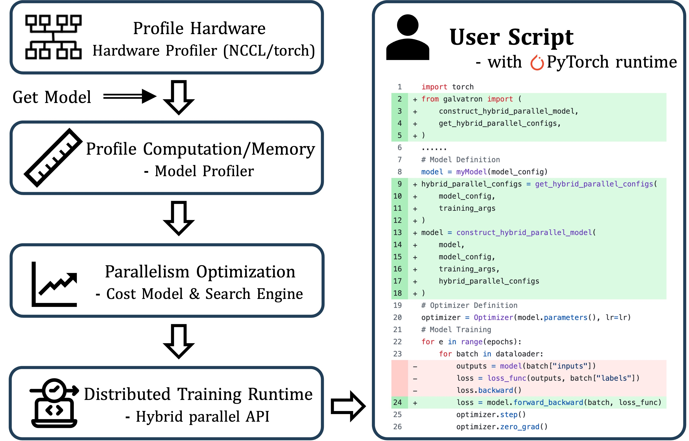

# [ASPLOS'25] FlexSP: Accelerating Large Language Model Training via Flexible Sequence Parallelism

This is the official implementation of ASPLOS'25 paper "FlexSP: Accelerating Large Language Model Training via Flexible Sequence Parallelism" [[Paper Link](https://arxiv.org/abs/2412.01523)].

<p align="center">

<figcaption align="center">        End-to-end evaluation (in seconds per iteration) for specific model sizes and maximum context lengths (Max Seq) across three datasets.Speedup ratios compared to DeepSpeed (green, left) and Megatron-LM (blue, right) are indicated.</figcaption>
</p>

## Abstract

Extending the context length (i.e., the maximum supported sequence length) of LLMs is of paramount significance. To facilitate long context training of LLMs, sequence parallelism has emerged as an essential technique, which scatters each input sequence across multiple devices and necessitates communication to process the sequence. In essence, existing sequence parallelism methods assume homogeneous sequence lengths (i.e., all input sequences are equal in length) and therefore leverages a single, static scattering strategy for all input sequences. However, in reality, the sequence lengths in LLM training corpora exhibit substantial variability, often following a long-tail distribution, which leads to workload heterogeneity.
In this paper, we show that employing a single, static strategy results in inefficiency and resource under-utilization, highlighting the need for adaptive approaches to handle the heterogeneous workloads across sequences. To address this, we propose a heterogeneity-adaptive sequence parallelism method. For each training step, our approach captures the variability in sequence lengths and assigns the optimal combination of scattering strategies based on workload characteristics. We model this problem as a linear programming optimization and design an efficient and effective solver to find the optimal solution. Furthermore, we implement our method in a high-performance system that supports adaptive parallelization in distributed LLM training.Experimental results demonstrate that our system outperforms state-of-the-art training frameworks by up to 1.98x.

<div align="center">
    
    <p>FlexSP System Overview</p>
</div>


## Build && Install
```bash
conda create -n flexSP python=3.9
conda activate flexSP
bash install.sh
```

## Examples
Train the GPT-7B model on a 16-GPU cluster using the Common Crawl dataset, with a batch size of 128 and a maximum sequence length of 64K:

```bash
cd galvatron/models/gpt_hf
bash scripts/train_dist_16gpus_7B_flexSP_CommonCrawl_bsz128_seqlen64K.sh
```
Alternatively, you can train on a 64-GPU cluster with a batch size of 512 and a maximum sequence length of 256K:
```bash
cd galvatron/models/gpt_hf
bash scripts/train_dist_64gpus_7B_flexSP_CommonCrawl_bsz512_seqlen256K.sh
```

## Code Structure

The core implementation of FlexSP is located in the `galvatron` directory, and below is an explanation of the code structure for several key components.

- `galvatron/`
  - `FlexSP_solver/`                  
    - `solver.py`             # CostModel & FlexSP solver implementation
  - `datasets/`               # Sampled tokenized sequence length
  - `models/`                
    - `gpt_hf/`        
      - `meta_configs/`       # Model configuration 
      - `train_dist.py`       # Training code
      - `GPTModel_*.py`       # Model definition
      - `dataloader.py`       # Specified dataloader
  - `core/`
    - `tensor_parallel/`
      - `transformer.py`      # Attention implementation to support Ulysses-style SP

## Methods

- Heterogenity-adaptive Sequence Parallelism: To enhance communication efficiency, FlexSP introduces a heterogeneity-adaptive sequence parallelism pattern that adaptively adjust the parallelism strategies given the diverse lengths, matching the heterogeneous workloads caused by varied-length sequences

<div align="center">
    
    <p>Illustration of heterogeneity-adaptive SP</p>
</div>


- FlexSP Solver: FlexSP Solver consists of a Sequence Blaster and a Parallelism Planner. The Sequence Blaster is responsible for splitting a global batch of sequences into micro-batches for gradient accumulation, while the Parallelism Planner determines the optimal sequence parallel strategy for each micro-batch.

## Acknowledgment
FlexSP is built on [Hetu-Galvatron](https://github.com/AFDWang/Hetu-Galvatron.git), with additional reference to [Megatron-DeepSpeed](https://github.com/microsoft/Megatron-DeepSpeed.git) for implementing Ulysses-style sequence parallelism.